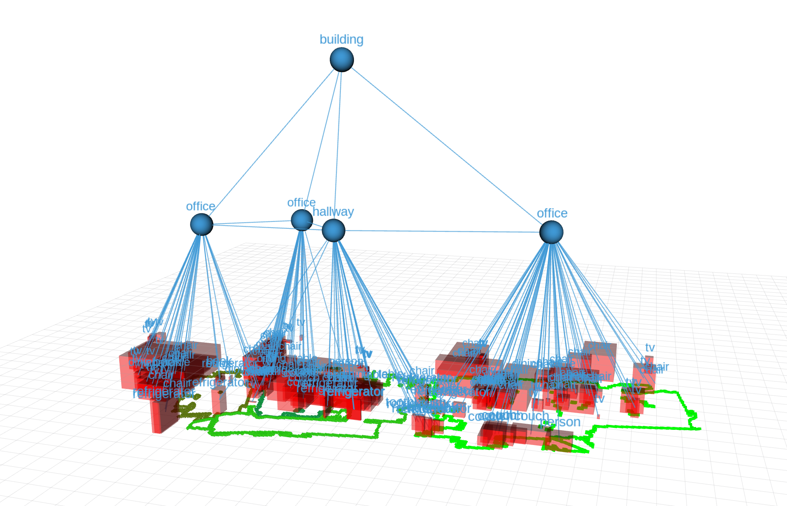

# A ROS Package for the Creation of a 3D Scene Graphs Utilizing Room Classification



## Description
This ROS packages enables the creation of a hierarchical 3D scene graph during runtime. In contrast to other solutions, rooms are segmented, classified and added as nodes as well.
A robot using this package has to be equipped with a camera that provides an RGB stream, as well as a depth stream. Optimally, the robot is equipped with a 360° laser scanner.
The package generates a 3D scene graph and comes with tools to visualize it using RViz. 


### Image Segmentation Module
Segments the current image from the RGB stream using YOLOv9 after synchronizing and publishes 2D object bounding boxes.

#### Subscribers
- RGB input stream: `/camera/color/image_raw` using `sensor_msgs/Image` messages
- Depth input stream: `/camera/depth/points` using `sensor_msgs/PointCloud2` messages
- Odometry input: `/camera/color/odom` using `nav_msgs/Odometry` messages

#### Publishers
- Synchronized RGB stream: `/scene_graph/color/image_raw` using `sensor_msgs/Image` messages
- Synchronized depth stream: `/scene_graph/depth/points` using `sensor_msgs/PointCloud2` messages
- Synchronized odometry stream: `/scene_graph/odom` using `nav_msgs/Odometry` messages
- Detected objects in current frame: `/scene_graph/detected_objects` using `scene_graph/DetectedObjects` messages

### Object Localization Module
Places the detected objects in 3D global space using the robot's odometry.

#### Subscribers
- Synchronized RGB stream: `/scene_graph/color/image_raw` using `sensor_msgs/Image` messages
- Synchronized depth stream: `/scene_graph/depth/points` using `sensor_msgs/PointCloud2` messages
- Synchronized odometry stream: `/scene_graph/odom` using `nav_msgs/Odometry` messages
- Detected objects in current frame: `/scene_graph/detected_objects` using `scene_graph/DetectedObjects` messages

#### Publishers
- Synchronized RGB stream: `/scene_graph/seen_graph_objects` using `scene_graph/GraphObjects` messages

### Room Classification Module
Classifies a single room utilizing a Random Forest Classifier on the base of given objects in that room.

#### Subscribers
- Objects in give room: `/scene/graph/room_with_objects` using `scene_graph/RoomWithObjects` messages

#### Publishers
- Classified room label: `/scene_graph/classified_room` using `scene_graph/ClassifiedRoom` messages

### Graph Management Module
Iteratively generates a 3D scene graph at runtime. Publishes messages to visualize the graph

#### Subscribers
- 3D bounding boxes of seen objects in the frame: `/scene_graph/seen_graph_objects` using `scene_graph/GraphObjects` messages
- Polygons of segmented rooms: `/scene_graph/rooms` using `scene_graph/RoomPolygonList` messages
- Label of classified room: `/scene_graph/classified_room` using `scene_graph/ClassifiedRoom` messages

#### Publishers
- Objects in the graph: `scene_graph/graph_objects` using `scene_graph/GraphObjects` messages
- Objects in a given room to be classified: `/scene/graph/room_with_objects` using `scene_graph/RoomWithObjects` messages
- Visualization of object bounding boxes: `/scene_graph/viz/object_bbox_marker` using `visualization_msgs/MarkerArray` messages
- Visualization of room nodes: `/scene_graph/viz/room_markers` using `visualization_msgs/MarkerArray` messages
- Visualization of building nodes: `/scene_graph/viz/building_markers` using `visualization_msgs/MarkerArray` messages
- Visualization of edges: `/scene_graph/viz/line_markers` using `visualization_msgs/MarkerArray` messages
- Visualization of node labels: `/scene_graph/viz/text_markers` using `visualization_msgs/MarkerArray` messages

## Prerequisites

- ROS Noetic on Ubuntu 20.04 LTS
- Camera that provides RGB- and depth-streams (e.g. Orbbec Astra)
- High-FOV laser scanner
- Robot compatible with ROS that comes with an IMU

## Installation
To install this package, install the [CGAL](https://www.cgal.org/) library and the [ultralytics](https://docs.ultralytics.com/models/yolov9/) package first. After that, clone and build this package.
```
pip install ultralytics
sudo apt-get install libcgal-dev
cd <your_catkin_workspace>/src
git clone https://github.com/sijanz/scene_graph
cd .. && catkin_make
```

## Usage
Run the whole scene graph creation pipeline as follows. Use a new terminal window for each command.
```
rosrun scene_graph ros_yolo_node.py
```
```
rosrun scene_graph object_localization_node
```
```
rosrun scene_graph room_classification_node
```
```
rosrun scene_graph graph_management_node
```